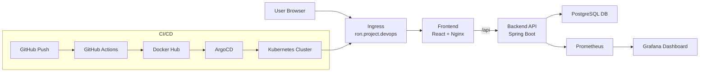

# 🚀 ProjectManager — Full DevOps Platform (CI/CD + Kubernetes + Monitoring)


---

## 📌 Overview

**ProjectManager** is a full-stack DevOps application demonstrating a complete production-like system:

* React frontend (modern UI with Tailwind)
* Spring Boot backend (REST API + JWT authentication)
* PostgreSQL database (persistent storage)
* Kubernetes deployment (Minikube)
* GitHub Actions CI/CD pipeline
* ArgoCD GitOps deployment
* Prometheus + Grafana monitoring
* Docker containerization
* Ingress with custom domain routing

---

## 🧱 Architecture

```text
Browser
   ↓
Ingress (ron.project.devops)
   ↓
Frontend (React + Nginx)
   ↓
/api
   ↓
Backend (Spring Boot)
   ↓
PostgreSQL
   ↓
Prometheus → Grafana
```

---

## 🔄 End-to-End Flow

```text
git push →
GitHub Actions:
  - build backend
  - build frontend
  - scan (Trivy)
  - push Docker images
  - update Kubernetes manifests
ArgoCD:
  - detects changes
  - auto-deploys to cluster
Ingress:
  - routes traffic to services
Browser:
  - interacts with live app
```

---

## 🧰 Tech Stack

### Frontend

* React
* TailwindCSS
* React Router
* Nginx (production build + SPA routing fix)

### Backend

* Java 17
* Spring Boot
* Spring Security + JWT

### DevOps

* Docker
* Kubernetes (Minikube)
* NGINX Ingress
* GitHub Actions
* ArgoCD (GitOps)

### Database

* PostgreSQL (with Kubernetes Secrets)

### Monitoring

* Prometheus
* Grafana

---

## 🔐 Features

* JWT authentication
* Role-based access (ADMIN / USER)
* Task management:

    * Create task
    * Delete task (ADMIN only)
    * Complete task
    * Assign task
* Persistent data (PostgreSQL)
* Modern responsive UI (TailwindCSS)

---

## 📦 Docker

### Backend

* Built using Maven + OpenJDK 17

### Frontend

* Multi-stage build (Node → Nginx)
* Custom `nginx.conf` for React routing (fixes 404 on refresh)

---

## ☸️ Kubernetes

### Components

* **Deployments**

    * frontend
    * backend

* **Services**

    * ClusterIP for internal communication

* **Ingress**

    * `/` → frontend
    * `/api` → backend

---

## 🌐 Access

```text
http://ron.project.devops
```

---

## 📊 Monitoring

* Prometheus collects backend metrics (`/actuator/prometheus`)
* Grafana dashboards visualize:

    * request rate
    * latency (P95)
    * error rate

---

## ⚙️ CI/CD Pipeline

```text
Build → Scan → Push → GitOps Deploy
```

### GitHub Actions

* Build backend JAR
* Build frontend image
* Scan with Trivy
* Push to Docker Hub
* Update Kubernetes YAML

### ArgoCD

* Watches repository
* Automatically syncs changes
* Deploys to Kubernetes cluster

---

## 🧪 Testing

### Login

```bash
curl -X POST http://ron.project.devops/api/auth/login \
-H "Content-Type: application/json" \
-d '{"username":"admin","password":"admin"}'
```

---

### Fetch Tasks

```bash
curl http://ron.project.devops/api/tasks \
-H "Authorization: Bearer <TOKEN>"
```

---

## 🧠 Key Challenges Solved

* Fixed React SPA routing (404 on refresh)
* Implemented JWT authentication flow
* Correct Ingress routing (`/api`)
* Solved CI/CD Git conflicts in GitHub Actions
* Synced frontend + backend via ArgoCD
* Integrated monitoring with Prometheus + Grafana

---

## 📁 Project Structure

```text
ProjectManager/
├── backend/
├── frontend/
├── k8s/
├── monitoring/
│   ├── prometheus/
│   └── grafana/
├── .github/workflows/
```

---

## 📈 Current Status

```text
✔ Full-stack application working
✔ Kubernetes deployment
✔ GitOps CI/CD pipeline
✔ Monitoring integrated
✔ Production-ready architecture
```

---

## 🚀 Roadmap

### 🔥 High Priority

* User management (create users, roles)
* Password validation + hashing (BCrypt)
* Force password change on first login

### ⚡ UX Improvements

* Toast notifications (replace alerts)
* Instant UI updates (optimistic UI)
* Search & filtering

### ☁️ DevOps Enhancements

* Helm charts
* Multi-environment (dev / prod)
* Autoscaling (HPA)

### 📊 Observability

* Alerts (latency, errors)
* Logging (Loki / ELK)
* Tracing (Jaeger)

---

## 👨‍💻 Author

Ron Nirzaaev
DevOps Engineer 🚀

---

## ⭐ Final Note

This project demonstrates a complete DevOps lifecycle:

```text
Build → Secure → Deploy → Monitor → Improve
```

---

## 🧩 Architecture Diagram (Visual)



---

## 📸 Screenshots

### 🔐 Login Page

> Modern UI with TailwindCSS


---

### 📋 Dashboard

> Task management with role-based actions


---

### ⚙️ Admin Actions

> Create, delete, assign, complete tasks


---

### 📊 Monitoring (Grafana)

> Real-time metrics visualization


---

## 📁 Screenshots Setup

Create this folder:

```id="mkf2zx"
frontend/public/screenshots/
```

Or in repo root:

```id="o2cz5t"
screenshots/
```

Then add images:

```id="r6kbv1"
login.png
dashboard.png
admin.png
grafana.png
```

---

## 💡 Tips

* Use real screenshots from your app (not placeholders)
* Keep images clean (crop browser UI if needed)
* Dark mode screenshots look more professional

---

## 🎥 Demo


